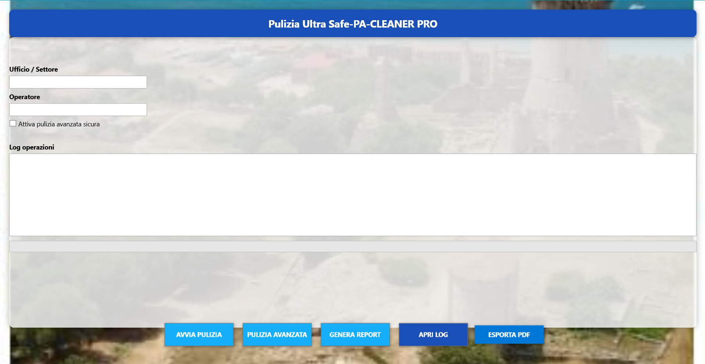

# Pulizia Ultra Safe PA-CLEANER PRO

## 🇮🇹 Descrizione
Pulizia Ultra Safe è uno strumento leggero e sicuro progettato per la manutenzione dei PC Windows.  
Consente di eliminare file temporanei, cache di sistema e residui di applicazioni in modo controllato, evitando percorsi sensibili grazie a un sistema di protezione integrato.  
Include un’interfaccia grafica moderna, report HTML, esportazione PDF e una modalità avanzata per una pulizia più profonda.

## 🇬🇧 Description
Pulizia Ultra Safe is a lightweight and safe tool designed for Windows PC maintenance.  
It removes temporary files, system cache, and application leftovers while protecting sensitive paths through a built‑in safety system.  
It includes a modern graphical interface, HTML reports, PDF export, and an advanced mode for deeper cleaning.

## Descrizione
Pulizia Ultra Safe è un tool sviluppato per semplificare e velocizzare le operazioni di manutenzione ordinaria dei computer negli uffici pubblici e anche privati  
L’interfaccia moderna e intuitiva permette agli operatori di effettuare pulizie sicure senza rischiare di eliminare file o programmi importanti.

## Funzionalità principali
- Pulizia standard sicura
- Pulizia avanzata opzionale
- Generazione automatica di report PDF
- Log dettagliati delle operazioni
- Interfaccia grafica moderna (WPF)
- Sfondo sfocato, header istituzionale, ombre e animazioni
- Completamente portabile (nessuna installazione richiesta)

## Requisiti
- Windows 10 o superiore
- PowerShell 5.1 o superiore
- Microsoft Edge (per l’esportazione PDF)

## Come si usa
1. Estrarre la cartella del progetto
2. Avviare il tool con **Antho.bat**
3. Inserire Ufficio e Operatore
4. Selezionare la modalità di pulizia
5. Visualizzare log e report generati automaticamente

## Screenshot

## Autore
Sviluppato da **Antonio – Tecnico Informatico**

## Licenza
Uso interno per uffici comunali e privati.  
Versione: **v1.0**

